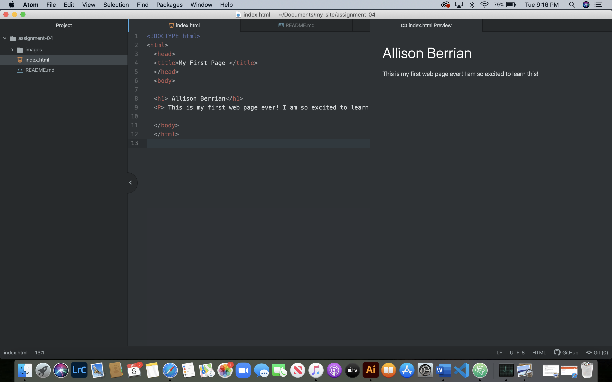

# Allison Berrian's MART341-WebDesign
I learned how to code basic information and use files and directories in GitHub

### Week 3
Absolute URL: https://www.umt.edu/cyberbear/default.php
Relative URL: /cyberbear/default.php

### Week 4
- Web browser work by the network providing the rendering engine the requested document. The rendering engine reads the html to construct the content tree (DOM). The CSS documentation is passed by the engine as well to create the styling associated with it (CSOM). This creates the render tree combining the to processing the layout of the page. The web browser I use mostly is Safari. I sometimes use Chrome.

 - Mark up language creates the text you see on the page. The one commonly used in development is Hypertext Markup Language (HTML). It is used to interpret and compose text, images, audio and other content.
 
### Week 5
  - I went to umt.edu.The site was very compact with visuals all over the place. There are less pages and fewer buttons to click to navigate the page.
  These last few topics have been a bit challenging trying to get everything to connect together. I feel like a few set backs have allowed me to better understand what I am doing.

### Week 6
-  There can only be 6 main documents. Head elements give the browser information. It has processing information and document metadata. The body element is what gets displayed on the clients computer.
- Structure mark up is the structure of the content being displayed such as spacing, line breaks and lists. Semantic  markup is used to bring attention to specific details or add context.
- My work cycle for this assignment started with going over the website and then following the steps on the assignment while referencing the website. I followed the steps in Atom then pushed it through on the GitHub desktop app.
### Week 7
- A form I came across while browsing the internet was the University of Montana search bar.
- Examples of text, selection and button input and their usage is a quiz on Moodle. The text would be an answer box to a long answer question, a selection would be choosing the correct answer in a multiple choice question and a button input would be a submit button to turn quiz into professor.
- My work cycle for this assignment was skimming over the website. Looking over the assignment and doing what I could on my own before referencing the website to complete the assignment in Atom before I pushed it through the GitHub desktop app.
